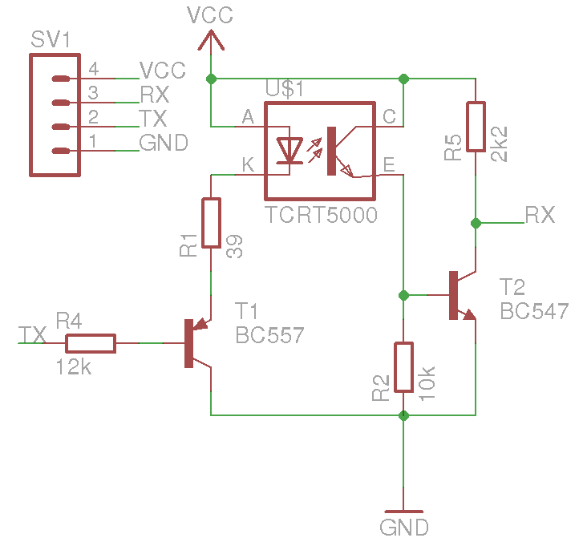

# Kamstrup IR Interface

This file should get you started to create a IR Interface that worked on my
Multical series smart district heat meter (66-C-0-x-y-zzz).

## Bill of materials
* A 3.3V TTL UART, for example:
  * a cheap eBay FTDI clone (make sure it's 3.3v)
  * UART on your SBC (Orange Pi)
* PCB:
  * Perfboard
  * U$1: CNY70 IR transceiver
  * SV1: 4-pin 0.1" header
  * R1: 39ohm
  * R2: 10k
  * R4: 12k
  * R5: 2k2
  * T1: BC557 (any PNP will do)
  * T2: BC547 (any NPN will do)
Optional:
  * a few powerful magnets (rare earth, see ebay)
  * a bunch of wire

## Schematic
**Since my EDA tool lacked a CNY70 part, and I'm lazy, I abused a TCRT5000 instead. Trust me, you'll want an CNY70 with a Kamstrup.**



## Magnet

As the meter contains a metal (magnetic?) ring around the IR port, I have
soldered some magnets using the wire to my perfboard. This makes the board stick
to my meter, which works quite robustly.

## Nuts config

The following excerpt works with my district heat meter:
```INI
[subsystem:heat]
class = SerialIECInterface
port = /dev/kamstrup
baud = 300
bits = 7
parity = E
stop = 2
timeout = 8
keys = heat_consumed, volume
request = /?!\r\n
sleep_after_request = 0.5
interval = 1800
```

## External Links
* [Multical type 66-CDE Technical Description](http://www.multical.hu/MC%2066C%20Technical%20Description%205511-634%20GB%20Rev%20C1.pdf)
* [Kamstrup 382 communication interface specification](https://www.kamstrup.com/en-en/~/media/files/protocols/iec61107_comprotocol.pdf)
* [Multical III & Ultraflow II Technical Description](http://www.multical.hu/MCIII%20and%20UF%20II%20Technical%20Description%2005%201997%20RevD1.pdf)
* [Frack - Stadsverwareming](https://frack.nl/wiki/Stadsverwarming)
* [HAL9k.dk - Kamstrup](http://wiki.hal9k.dk/projects/kamstrup)
